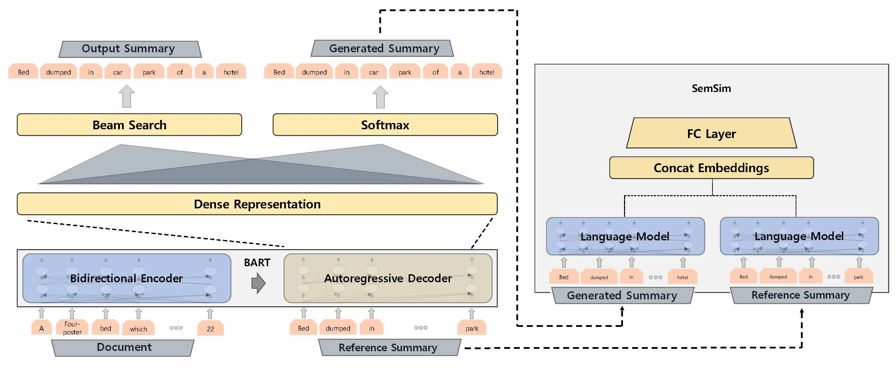

# Learning by Semantic Similarity Makes Abstractive Summarization Better


Under review.
<br>Please be noticed that the majority of Git logs were intentionally omitted to keep the review process Double-Blind.
<br>We will redirect or update this repository after we receive the final decisions.

<br>This repository provides pre-processed dataset, source code, and pre-trained weights used for our experiment.

### Full documentation will be released soon (within a few days).



## Folder description
```
/--|fairseq-semsim/
   |datasets/
   |README.md
   |model.jpg
```
   
*  `/fairseq-semsim` : The codes for our model. Modified from [fairseq (v 0.8.0 : 534905)](https://github.com/pytorch/fairseq/tree/5349052aae4ec1350822c894fbb6be350dff61a0) and [Rewarder](https://github.com/yg211/summary-reward-no-reference) repositories.
*  `/datasets` (upcoming) : Our version of the pre-processed CNN/DM dataset and the pre-processing code. Modified from [PGN by See et al.](https://github.com/abisee/cnn-dailymail) following instructions of [BART (issue #1391)](https://github.com/pytorch/fairseq/issues/1391)


## Requirements and Installation
### For preparing (pre-processing) the CNN/DM dataset
Please check README inside [datasets](./datasets) folder.

### For fine-tuning and inferencing 
* PyTorch version >= 1.2.0
* Python version >= 3.6
* fairseq == 0.8.0
* pytorch_transformers == 1.2.0

Also you need to install fairseq from the source
```
cd fairseq-semsim
pip install --editable .
```

For inferencing, our pre-trained weight is also available  [here](https://drive.google.com/open?id=1CNgK6ZkaqUD239h_6GkLmfUOGgryc2v9).

|    Name   |                  SHA1SUM                 |
|:---------:|:----------------------------------------:|
| semsim.pt | d7ba2c2e06201e373a5e53cffe40d153ee867cc4 | 


## Fine-tuning the model

If you wish to fine-tune SemSim model your own from [BART checkpoint](https://github.com/pytorch/fairseq/tree/master/examples/bart), please download the checkpoint `bart.large.cnn`.

Our example code and instructions are copied and modfied from [fairseq](https://github.com/pytorch/fairseq/tree/5349052aae4ec1350822c894fbb6be350dff61a0).
### 1) Get data-files from [here](./datasets) and move files to `/fairseq-semsim/cnn_dm` folder.

### 2) BPE preprocess:
<b>Please make sure that you are executing the commands from the `/fairseq-semsim` folder.</b>
```
cd fairseq-semsim
```

```bash
wget -N 'https://dl.fbaipublicfiles.com/fairseq/gpt2_bpe/encoder.json'
wget -N 'https://dl.fbaipublicfiles.com/fairseq/gpt2_bpe/vocab.bpe'
wget -N 'https://dl.fbaipublicfiles.com/fairseq/gpt2_bpe/dict.txt'

for SPLIT in train val
do
  for LANG in source target
  do
    python -m examples.roberta.multiprocessing_bpe_encoder \
    --encoder-json encoder.json \
    --vocab-bpe vocab.bpe \
    --inputs "cnn_dm/$SPLIT.$LANG" \
    --outputs "cnn_dm/$SPLIT.bpe.$LANG" \
    --workers 60 \
    --keep-empty;
  done
done
```

### 3) Binarize dataset:
```bash
fairseq-preprocess \
  --source-lang "source" \
  --target-lang "target" \
  --trainpref "cnn_dm/train.bpe" \
  --validpref "cnn_dm/val.bpe" \
  --destdir "cnn_dm-bin/" \
  --workers 60 \
  --srcdict dict.txt \
  --tgtdict dict.txt;
```

### 4) Fine-tuning `bart.large.cnn` with SemSim approach on CNN-DM summarization task:

Use the following command to fine-tune `bart.large.cnn` with SemSim strategy.
```
BART_PATH=/pretrained/BART/bart.large.cnn/model.pt 


TOTAL_NUM_UPDATES=50000  
WARMUP_UPDATES=500      
LR=3e-05
MAX_TOKENS=1792
UPDATE_FREQ=32

python train.py cnn_dm-bin \
    --restore-file $BART_PATH \
    --max-tokens $MAX_TOKENS \
    --task translation \
    --source-lang source --target-lang target \
    --layernorm-embedding \
    --share-all-embeddings \
    --share-decoder-input-output-embed \
    --reset-optimizer --reset-dataloader --reset-meters \
    --required-batch-size-multiple 1 \
    --arch bart_large \
    --criterion semantic_similarity_loss \
    --label-smoothing 0.1 \
    --dropout 0.1 --attention-dropout 0.1 \
    --weight-decay 0.01 --optimizer adam --adam-betas "(0.9, 0.999 )" --adam-eps 1e-08 \
    --clip-norm 0.1 \
    --lr-scheduler polynomial_decay --lr $LR --total-num-update $TOTAL_NUM_UPDATES --warmup-updates $WARMUP_UPDATES \
    --update-freq $UPDATE_FREQ \
    --skip-invalid-size-inputs-valid-test \
    --save-dir checkpoints/semsim \
    --find-unused-parameters;
```
We followed most of default settings of BART. However, we removed a few options such as `--truncate-source` and `--fp16 `.
We used one NVIDIA TITAN RTX GPU with 24GB memory and it took 7~9 hours for a single epoch. We achieved best performace at epoch 6. 

For details, check the instructions from [`/fairseq-semsim`](./fairseq-semsim) and [`Fine-tuning BART`](./fairseq-semsim/examples/bart/README.cnn.md) file.


## Evaluating the model (Inferencing)
<b>Please make sure that you are executing following python script from the `/fairseq-semsim` folder.</b>
```
cd fairseq-semsim
```

Run following python script to generate summaries.
<br>(Please also check instructions from [BART repository](./fairseq-semsim/examples/bart#evaluating-the-bartlargecnn-model) for details.)
```
import torch
from fairseq.models.bart import BARTModel

bart = BARTModel.from_pretrained(
    'checkpoints/',
    checkpoint_file='semsim.pt',
    data_name_or_path='cnn_dm-bin'
)

bart.cuda()
bart.eval()
bart.half()
count = 1
bsz = 32
with open('cnn_dm/test.source') as source, open('cnn_dm/test.hypo', 'w') as fout:
    sline = source.readline().strip()
    slines = [sline]
    for sline in source:
        if count % bsz == 0:
            with torch.no_grad():
                hypotheses_batch = bart.sample(slines, beam=4, lenpen=2.0, max_len_b=140, min_len=55, no_repeat_ngram_size=3)

            for hypothesis in hypotheses_batch:
                fout.write(hypothesis + '\n')
                fout.flush()
            slines = []

        slines.append(sline.strip())
        count += 1
    if slines != []:
        hypotheses_batch = bart.sample(slines, beam=4, lenpen=2.0, max_len_b=140, min_len=55, no_repeat_ngram_size=3)
        for hypothesis in hypotheses_batch:
            fout.write(hypothesis + '\n')
            fout.flush()
```

Install `files2rouge` from [here](https://github.com/pltrdy/files2rouge).

```bash
export CLASSPATH=/path/to/stanford-corenlp-full-2016-10-31/stanford-corenlp-3.7.0.jar

# Tokenize hypothesis and target files.
cat test.hypo | java edu.stanford.nlp.process.PTBTokenizer -ioFileList -preserveLines > test.hypo.tokenized
cat test.target | java edu.stanford.nlp.process.PTBTokenizer -ioFileList -preserveLines > test.hypo.target
files2rouge test.hypo.tokenized test.hypo.target
# Expected output: (ROUGE-L Average_F: 0.4153)
```
You will need java library to run CoreNLP. 

